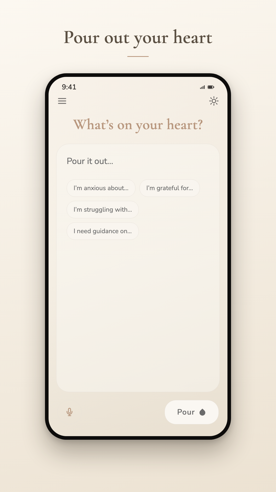
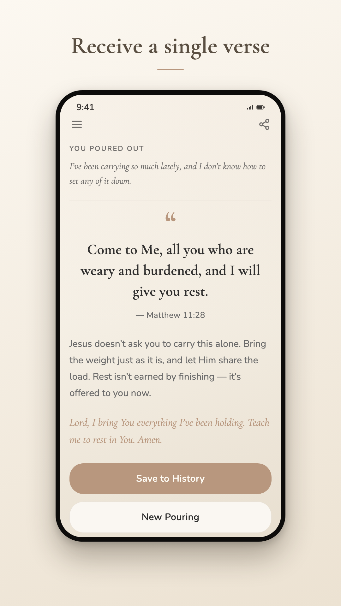
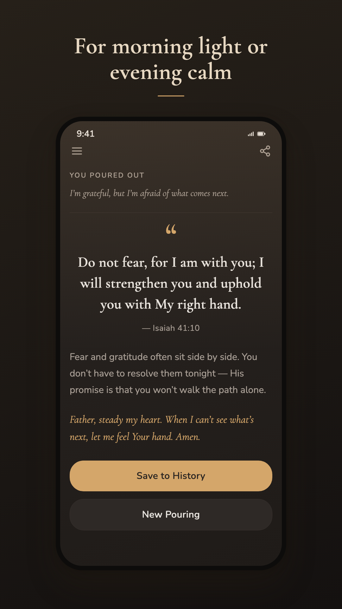
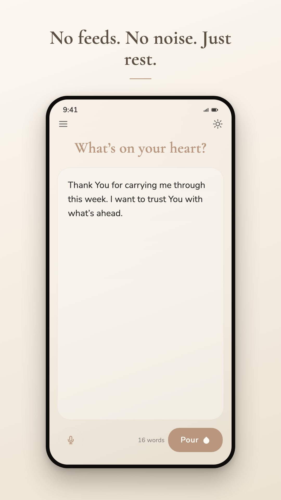

<p align="center">
  
</p>

<p align="center">
  A private, reverent mobile app for Christians to process thoughts and struggles<br>
  through AI-guided scriptural reflection.
</p>

<p align="center">
  
  
  
  
  
</p>

---

## About

Users write a reflection ("Pouring"), and Manna returns a single Bible verse (Berean Standard Bible) with an empathetic explanation and a closing prayer prompt. Built with privacy and minimalism at its core — no push notifications, no social features, no ads in sacred spaces.

<p align="center">
  
  
  
  
</p>

## Guiding Principles

- 🕊️ **Reverence over interaction** — a digital prayer closet, not a chatbot
- 🔒 **Privacy first** — entries are encrypted (AES-256) and never shared
- 🌾 **Focus over volume** — one verse per session, no endless feeds
- 🤲 **Free forever** — no paywalls or subscriptions, only voluntary tips

## Themes

- ☀️ **Morning** — warm off-white creams with soft brown accents
- 🌙 **Sanctuary** — warm brownish charcoals with amber accents

## Tech Stack

| Layer     | Technology                                                                             |
| --------- | -------------------------------------------------------------------------------------- |
| App       | [Expo](https://expo.dev) (React Native) — iOS & Android                                |
| AI        | [Claude](https://www.anthropic.com/claude) — context inference and scriptural guidance |
| Scripture | [YouVersion Platform API](https://platform.youversion.com) — Berean Standard Bible     |
| Backend   | [Supabase](https://supabase.com) — edge functions & encrypted storage                  |

## Getting Started

```bash
npm install
npm start
```

Then press `i` for iOS simulator or `a` for Android emulator.

## Scripts

- `npm start` — Start Expo dev server
- `npm run ios` — Start on iOS
- `npm run android` — Start on Android
- `npm run web` — Start on web

---

<p align="center">
  <sub><em>“Man shall not live on bread alone, but on every word that comes from the mouth of God.”</em> — Matthew 4:4</sub>
</p>
